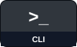
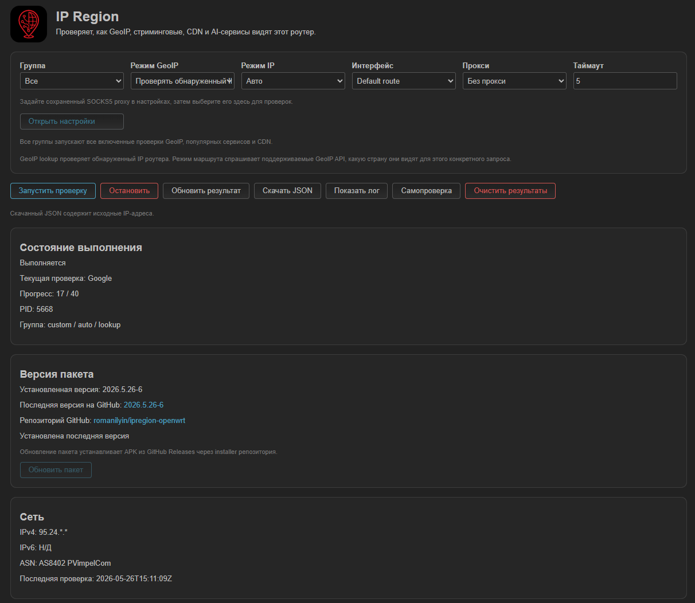
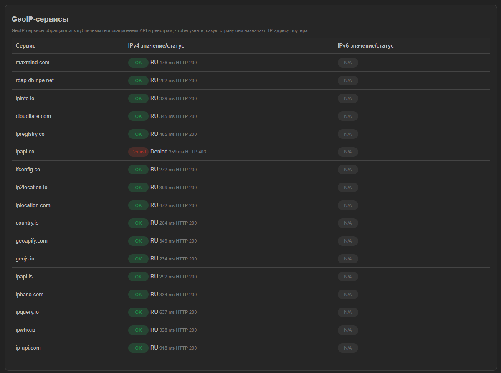
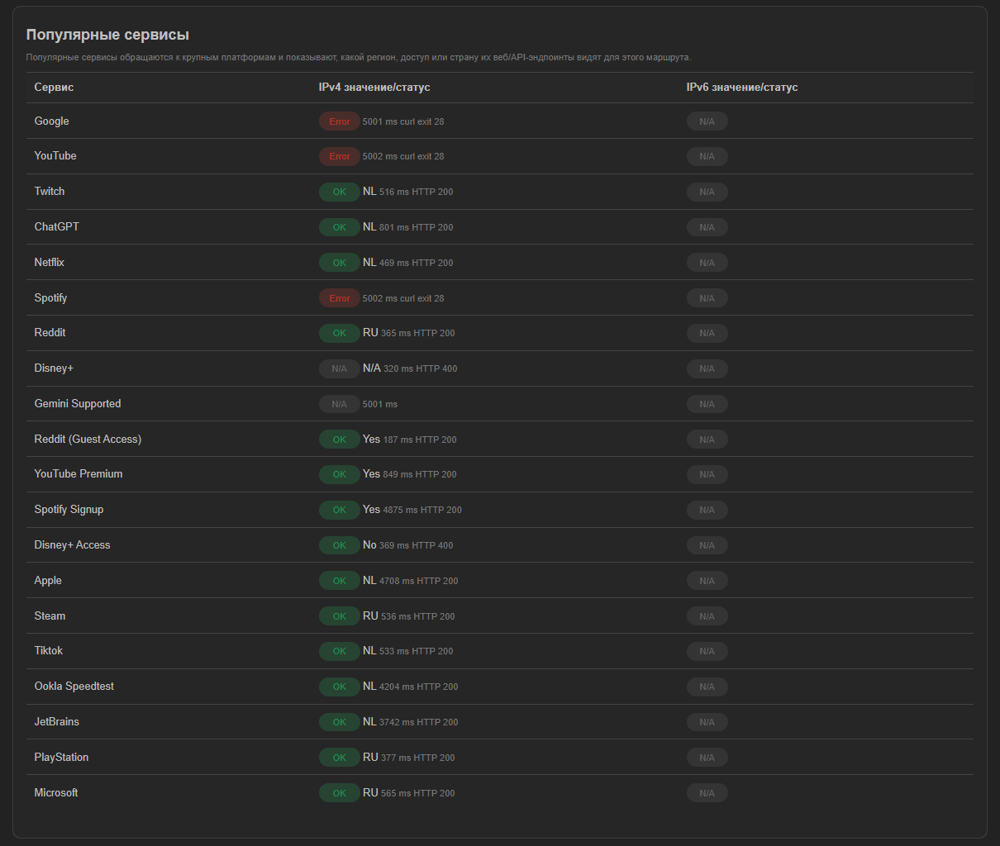
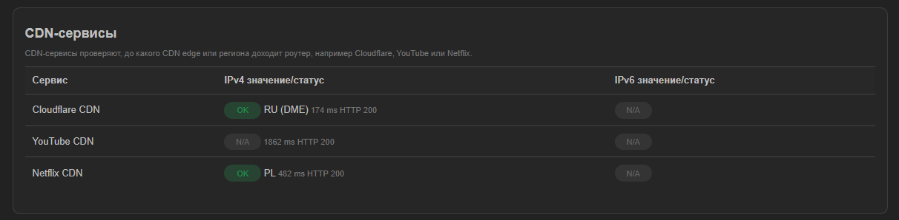
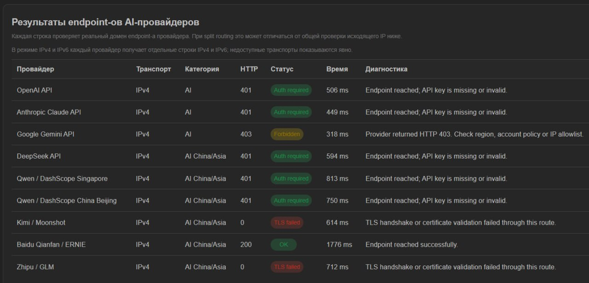

<div align="center">


# IPRegion for OpenWrt

**Route, region, CDN, AI endpoint and DNS integrity diagnostics for OpenWrt routers.**

[English](./README.md) |
[Русский](./docs/README.ru.md) |
[Development](./docs/DEVELOPMENT.md) |
[Разработка](./docs/DEVELOPMENT.ru.md) |
[Releases](https://github.com/romanilyin/ipregion-openwrt/releases)

[](https://github.com/romanilyin/ipregion-openwrt/actions/workflows/ci.yml)

<p>
  <a href="#what-it-does"></a>
  <a href="#cli-examples"></a>
  <a href="#luci"></a>
  <a href="#install-apk"></a>
  <a href="#install-ipk"></a>
</p>

</div>

IPRegion is an OpenWrt CLI and LuCI app for checking how GeoIP APIs, popular services, CDN endpoints and AI providers see your router route, and comparing public DNS responses over UDP, TCP, DoH and DoT.

Validated current runtime target: OpenWrt 25.12.1+ with `apk`. OpenWrt 24.10.* support remains experimental and its installer is pinned to an older validated package release.

## What It Does

IPRegion runs diagnostics from the router itself and compares independent service results in one UI and JSON output.

- GeoIP checks show what country public geolocation APIs assign to the route.
- Popular service checks show region, access, rate-limit or denial signals from major platforms.
- CDN checks show which CDN edge or region the router reaches.
- AI checks probe real AI web and API endpoint domains in safe unauthenticated mode.
- DNS security checks compare UDP/53, TCP/53, DoH and DoT responses from Google, Cloudflare, Quad9, AdGuard DNS and Yandex DNS; plain DNS learned from the active interface is included when available.
- Checks can use the default route, a selected OpenWrt interface or a SOCKS5 proxy.

Packages:

- `ipregion`: CLI/backend diagnostics implemented in `ucode`.
- `ipregion-dns-helper`: small architecture-specific UDP, TCP and certificate-verified DoT transport helper.
- `luci-app-ipregion`: LuCI UI under `Status -> IP Region`.
- `luci-i18n-ipregion-ru`: Russian LuCI translation.

The release `ipregion`, `luci-app-ipregion` and `luci-i18n-ipregion-ru` packages are `noarch`. The native `ipregion-dns-helper` is built per OpenWrt package architecture and reuses the `libcurl` dependency already installed for IPRegion. Current APK assets support `aarch64_cortex-a53`, `x86_64`, `mipsel_24kc` and `mips_24kc`. The pinned legacy IPK release is for OpenWrt 24.10.*.

## Screenshots

<table>
  <tr>
    <td width="50%"></td>
    <td width="50%"></td>
  </tr>
  <tr>
    <td width="50%"></td>
    <td width="50%"></td>
  </tr>
  <tr>
    <td colspan="2"></td>
  </tr>
</table>

## Install APK

Run on an OpenWrt 25.12.1+ router:

```sh
wget -qO- https://raw.githubusercontent.com/romanilyin/ipregion-openwrt/main/install.sh | sh
```

The installer detects `DISTRIB_ARCH`, downloads its `ipregion-dns-helper-<architecture>.apk` plus the common `ipregion*.apk`, `luci-app-ipregion*.apk` and `luci-i18n-ipregion-ru*.apk` assets from the latest GitHub Release, and installs them with `apk`.

Installation requires one of the package architectures listed above. Other OpenWrt architectures need a separately built and published `ipregion-dns-helper` APK.

Release tags use `YYYY.M.D-N`. OpenWrt package metadata displays the same package revision as `YYYY.M.D-rN`, where `r` is the standard `PKG_RELEASE` marker.

APK installer options:

- `IPREGION_RELEASE=2026.9.2-2`: install a specific GitHub release tag instead of `latest`.
- `IPREGION_INSTALL_LUCI=0`: install only the CLI/backend package.
- `IPREGION_APK_UPDATE=0`: skip `apk update` before installation.
- `IPREGION_DOWNLOAD_RETRIES=5`: retry GitHub metadata and APK downloads more times.
- `IPREGION_PACKAGE_ARCH=aarch64_cortex-a53`: override package architecture detection on an apk-based OpenWrt derivative.

Pinned release example:

```sh
wget -qO- https://raw.githubusercontent.com/romanilyin/ipregion-openwrt/main/install.sh | IPREGION_RELEASE=2026.9.2-2 sh
```

Manual install from downloaded APK files:

```sh
. /etc/openwrt_release
apk add --allow-untrusted "./ipregion-dns-helper-${DISTRIB_ARCH}.apk" ./ipregion.apk ./luci-app-ipregion.apk ./luci-i18n-ipregion-ru.apk
```

## Install IPK

Run on an OpenWrt 24.10.* router:

```sh
wget -qO- https://raw.githubusercontent.com/romanilyin/ipregion-openwrt/main/install-ipk.sh | sh
```

The experimental IPK installer defaults to the last release validated on real OpenWrt 24.10 hardware, `2026.5.28-1`, and installs its `ipregion*.ipk`, `luci-app-ipregion*.ipk` and `luci-i18n-ipregion-ru*.ipk` assets with `opkg`. The current native-helper package split is not supported by this installer yet. Set `IPREGION_RELEASE` only to another release that explicitly includes a compatible, validated IPK package set.

Manual install from downloaded IPK files:

```sh
opkg install ./ipregion*.ipk ./luci-app-ipregion*.ipk ./luci-i18n-ipregion-ru*.ipk
```

## LuCI

Open `Status -> IP Region` in LuCI.

- Run GeoIP, popular service, CDN, unified DNS integrity and AI endpoint checks from one page.
- Choose IP mode, interface, SOCKS5 proxy, timeout and GeoIP mode.
- Configure multiple SOCKS5 proxy profiles in `Services -> IP Region`, including per-profile local or remote DNS, then select any profile on the Status page.
- Set a reference country to highlight matching country values in orange and different country values in blue.
- AI checks show separate IPv4 and IPv6 provider rows when `IPv4 and IPv6` mode is selected; unavailable transports are shown explicitly.
- View progress while checks run.
- Download raw JSON results or copy privacy-safe Markdown tables. Markdown omits raw IP addresses, proxy endpoints and route identifiers.
- Update the package from GitHub Releases through the version card; downgrade protection prevents installing an older latest release.
- Open `Services -> IP Region` for default UCI settings.
- The settings page reports compressed APK and installed flash sizes for each IPRegion package. It can remove a legacy `knot-dig` installation left by an older release.

## CLI Examples

```sh
ipregion --help
ipregion --list-services --json
ipregion --self-test --json
ipregion --group primary --ipv4 --json
ipregion --group custom --ipv4 --json
ipregion --group cdn --ipv4 --json
ipregion --group primary --geoip-mode route --json
ipregion --interface wan --group primary --json
ipregion --proxy 127.0.0.1:1080 --proxy-dns remote --group custom --json
ipregion ai --json
ipregion ai --provider google_gemini --json
ipregion ai --provider google_gemini_web --json
ipregion dns --json
ipregion dns --provider google --transport all --ip-mode ipv4 --json
ipregion dns --provider interface_dns --transport plain --ip-mode ipv4 --json
```

## Check Modes

- `--group all`: run every enabled GeoIP, popular service and CDN check.
- `--group primary`: GeoIP services.
- `--group custom`: popular services.
- `--group cdn`: CDN services.
- `--geoip-mode lookup`: discover the router egress IP first, then ask GeoIP APIs to look up that IP.
- `--geoip-mode route`: ask supported GeoIP APIs what country they see for the request itself.
- `ipregion ai --json`: run safe AI web/API endpoint probes without storing or requesting API keys.
- `ipregion ai --ip-mode both --json`: run each selected AI provider through separate IPv4 and IPv6 probes.
- `ipregion dns --json`: run UDP/53, TCP/53, DoH and DoT in one check and compare response codes and answers.
- `ipregion dns --dns-name example.com --dns-type A --json`: run all DNS transports for a validated query name and record type.
- `--transport plain`, `udp`, `tcp`, `doh` or `dot`: run focused DNS transports; legacy `both` remains the DoH+DoT pair.

For SOCKS5 proxy checks:

- `--proxy-dns remote` uses `socks5h://`.
- `--proxy-dns local` uses `socks5://`.

## Notes

- `401`, `403`, `404`, `405` and `429` in AI mode can still mean that the provider endpoint was reached; DNS, TLS, timeout and network failures are classified separately.
- Google Gemini Web uses `gemini.google.com`; the separate Gemini API probe uses `generativelanguage.googleapis.com`. Domain-based split routing must cover each hostname that should use the VPN.
- Public DNS checks connect to published resolver IP addresses; DoH and DoT additionally verify provider TLS hostnames. Interface DNS addresses are read from the selected or active default OpenWrt interface and are tested over UDP/TCP only.
- UDP, TCP and DoT use the small native IPRegion DNS helper. DoT performs CA, hostname and SNI verification through the existing `libcurl` TLS backend; `knot-dig` is not required.
- DNS mode ignores a proxy saved in UCI and rejects an explicit `--proxy`; DoH binds to a selected interface, while UDP, TCP and DoT bind to that interface's source address.
- DNS `auto` mode prefers an available IPv4 default route and falls back to IPv6 on IPv6-only routers; use `--ip-mode both` to test both explicitly.
- An `interception likely` result requires a response-code mismatch against authenticated DNS. Matching responses mean no mismatch was detected, not proof that interception is absent; answer-only differences remain inconclusive because CDN variation can be legitimate.
- With domain-based split routing, a generic egress IP check can differ from the route used by a specific service or AI endpoint domain.
- For policy-routing setups, a local SOCKS5 endpoint that already exits through the intended tunnel is usually the most reliable diagnostic target.

## Privacy And Scope

Diagnostics contact third-party GeoIP, streaming, CDN, AI and public DNS endpoints. Those services receive the router's public IP for each check.

Runtime state, results and logs stay local under `/tmp/run/ipregion/`.

IPRegion is diagnostics-only. It does not add or change firewall, nftables, mwan3, podkop, WARP or routing rules.

## Attribution

Inspired by and service-compatible with [`vernette/ipregion`](https://github.com/vernette/ipregion), but rewritten as an OpenWrt-native `ucode` backend and LuCI application.
