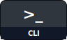
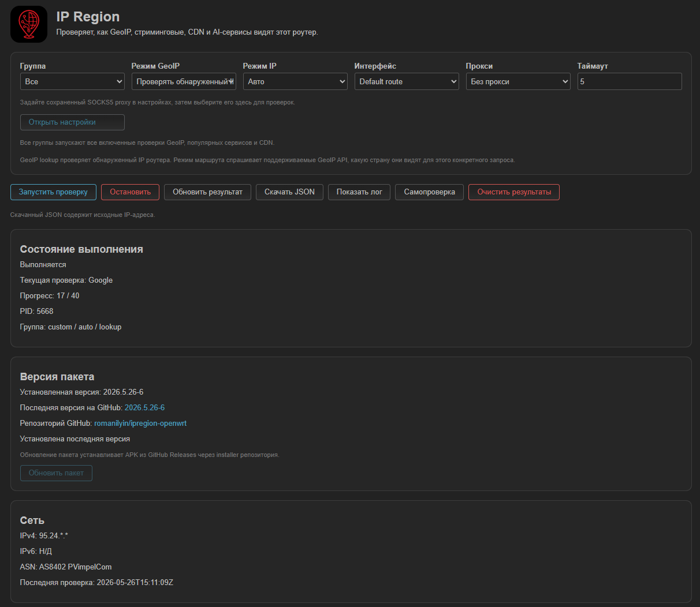
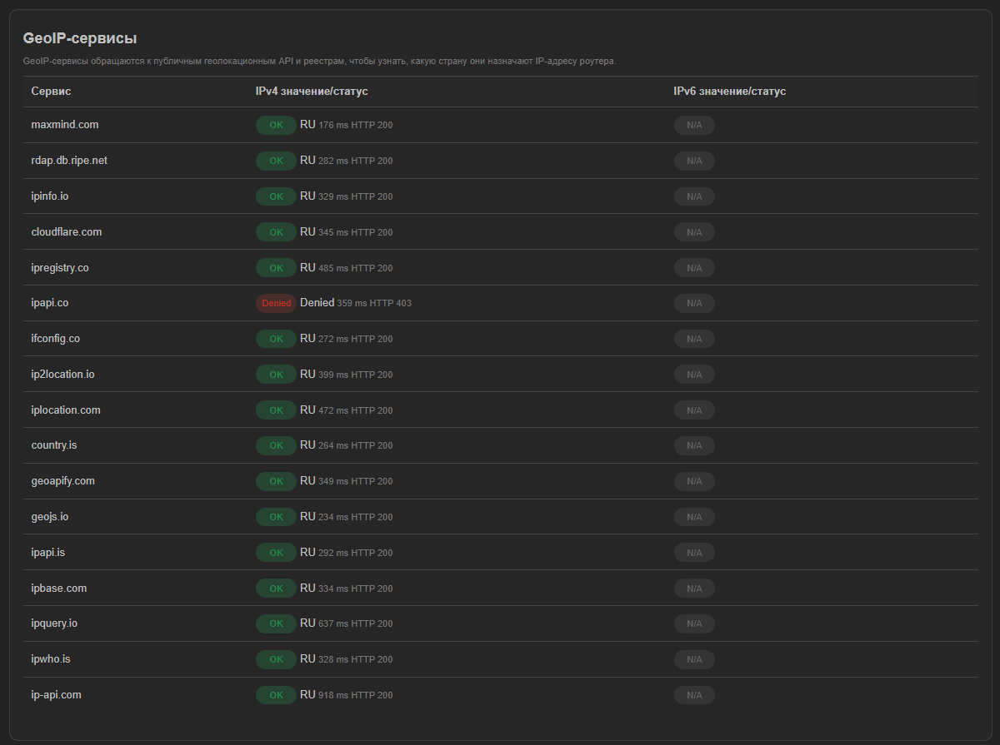
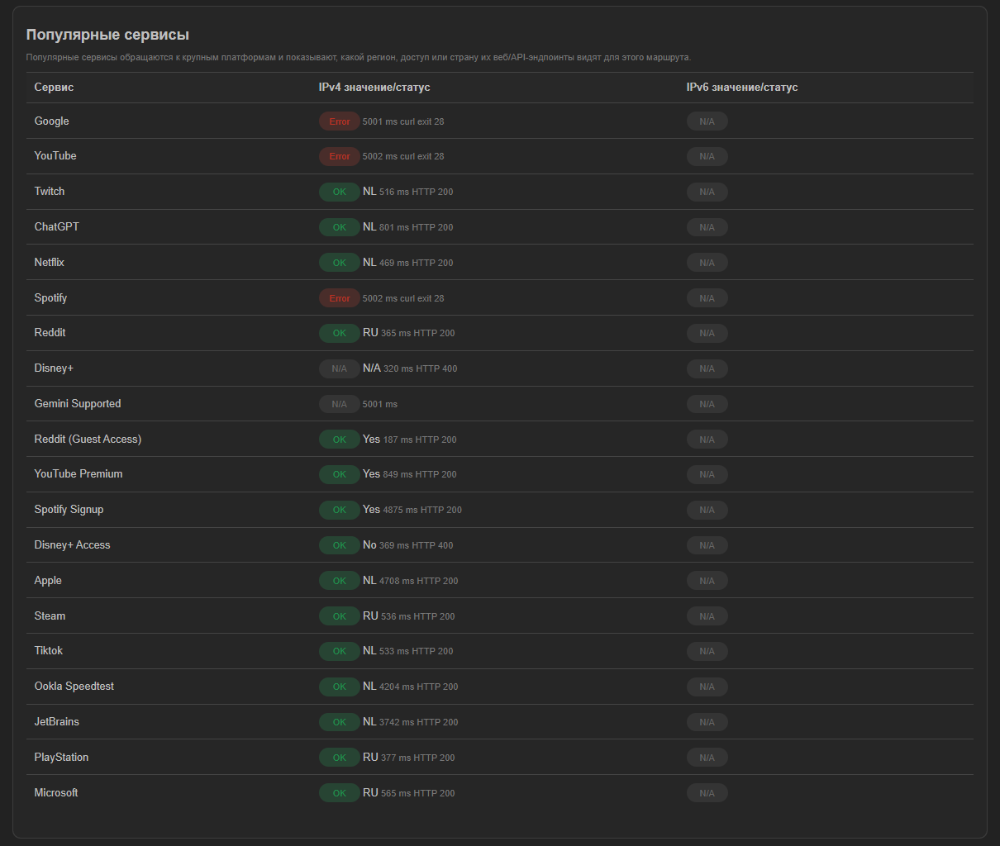
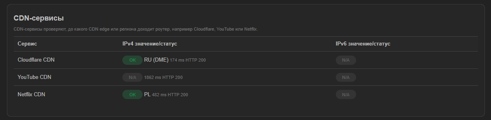
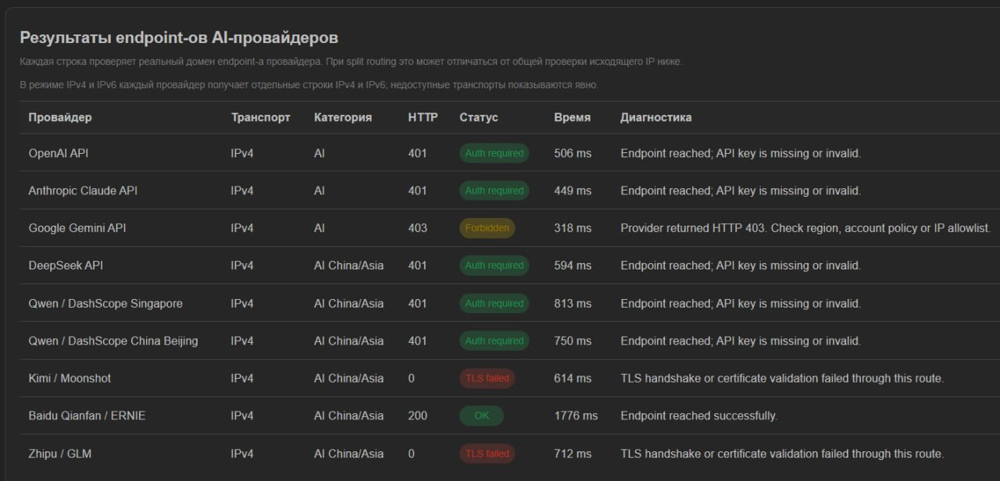

<div align="center">


# IPRegion for OpenWrt

**Диагностика маршрута, региона, CDN и AI endpoint-ов для OpenWrt-роутеров.**

[English](../README.md) |
[Русский](./README.ru.md) |
[Development](./DEVELOPMENT.md) |
[Разработка](./DEVELOPMENT.ru.md) |
[Releases](https://github.com/romanilyin/ipregion-openwrt/releases)

[](https://github.com/romanilyin/ipregion-openwrt/actions/workflows/ci.yml)

<p>
  <a href="#что-делает"></a>
  <a href="#cli"></a>
  <a href="#luci"></a>
  <a href="#установка-apk"></a>
  <a href="#установка-ipk"></a>
</p>

</div>

IPRegion это CLI и LuCI-приложение для OpenWrt, которое проверяет, как GeoIP API, популярные сервисы, CDN endpoint-ы и AI-провайдеры видят маршрут роутера, интерфейс или SOCKS5-прокси.

Проверенные runtime-цели: OpenWrt 25.12.1+ с `apk` и OpenWrt 24.10.6 с `opkg`.

## Что Делает

IPRegion запускает диагностику на самом роутере и показывает результаты разных сервисов в одном UI и JSON.

- GeoIP-проверки показывают, какую страну публичные геолокационные API назначают маршруту.
- Проверки популярных сервисов показывают регион, доступ, rate-limit или отказ от крупных платформ.
- CDN-проверки показывают, до какого CDN edge или региона доходит роутер.
- AI-проверки безопасно проверяют реальные домены AI API endpoint-ов без авторизации.
- Проверки могут идти через маршрут по умолчанию, выбранный OpenWrt-интерфейс или SOCKS5-прокси.

Пакеты:

- `ipregion`: CLI/backend диагностики на `ucode`.
- `luci-app-ipregion`: LuCI UI в `Status -> IP Region`.
- `luci-i18n-ipregion-ru`: русский перевод LuCI.

Release-пакеты `ipregion`, `luci-app-ipregion` и `luci-i18n-ipregion-ru` собираются как `noarch`. APK assets предназначены для OpenWrt 25.12.1+; IPK assets предназначены для OpenWrt 24.10.*.

## Скриншоты

<table>
  <tr>
    <td width="50%"></td>
    <td width="50%"></td>
  </tr>
  <tr>
    <td width="50%"></td>
    <td width="50%"></td>
  </tr>
  <tr>
    <td colspan="2"></td>
  </tr>
</table>

## Установка APK

Запустите на роутере с OpenWrt 25.12.1+:

```sh
wget -qO- https://raw.githubusercontent.com/romanilyin/ipregion-openwrt/main/install.sh | sh
```

Installer скачивает `ipregion*.apk`, `luci-app-ipregion*.apk` и `luci-i18n-ipregion-ru*.apk` из последнего GitHub Release и ставит их через `apk`.

Опции APK installer:

- `IPREGION_RELEASE=2026.5.28-1`: поставить конкретный GitHub release tag вместо `latest`.
- `IPREGION_INSTALL_LUCI=0`: поставить только CLI/backend пакет.
- `IPREGION_APK_UPDATE=0`: не запускать `apk update` перед установкой.
- `IPREGION_DOWNLOAD_RETRIES=5`: увеличить число повторов для GitHub metadata и APK downloads.

Пример с фиксированным release:

```sh
wget -qO- https://raw.githubusercontent.com/romanilyin/ipregion-openwrt/main/install.sh | IPREGION_RELEASE=2026.5.28-1 sh
```

Ручная установка скачанных APK:

```sh
apk add --allow-untrusted ./ipregion-*.apk ./luci-app-ipregion-*.apk ./luci-i18n-ipregion-ru-*.apk
```

## Установка IPK

Запустите на роутере с OpenWrt 24.10.*:

```sh
wget -qO- https://raw.githubusercontent.com/romanilyin/ipregion-openwrt/main/install-ipk.sh | sh
```

IPK installer скачивает `ipregion*.ipk`, `luci-app-ipregion*.ipk` и `luci-i18n-ipregion-ru*.ipk` из последнего GitHub Release и ставит их через `opkg`. Он отдельный от APK installer, чтобы не смешивать package managers OpenWrt.

Ручная установка скачанных IPK:

```sh
opkg install ./ipregion*.ipk ./luci-app-ipregion*.ipk ./luci-i18n-ipregion-ru*.ipk
```

## LuCI

Откройте `Status -> IP Region` в LuCI.

- Запускайте GeoIP, popular service, CDN и AI endpoint проверки с одной страницы.
- Выбирайте IP mode, interface, SOCKS5 proxy, timeout и GeoIP mode.
- Настройте сохраненный SOCKS5 proxy в `Services -> IP Region`, затем выберите его на странице Status.
- Задавайте реальную страну, чтобы совпадающие значения подсвечивались оранжевым, а отличающиеся - синим.
- AI-проверки показывают отдельные строки IPv4 и IPv6 для каждого провайдера в режиме `IPv4 и IPv6`; недоступные транспорты отображаются явно.
- Смотрите прогресс во время выполнения.
- Скачивайте JSON результата. JSON содержит исходные IP-адреса.
- Обновляйте пакет из GitHub Releases через карточку версии; защита от downgrade не даст установить более старый latest release.
- Откройте `Services -> IP Region` для UCI-настроек по умолчанию.

## CLI

```sh
ipregion --help
ipregion --list-services --json
ipregion --self-test --json
ipregion --group primary --ipv4 --json
ipregion --group custom --ipv4 --json
ipregion --group cdn --ipv4 --json
ipregion --group primary --geoip-mode route --json
ipregion --interface wan --group primary --json
ipregion --proxy 127.0.0.1:1080 --proxy-dns remote --group custom --json
ipregion ai --json
ipregion ai --provider google_gemini --json
```

## Режимы Проверок

- `--group all`: все включенные GeoIP, popular service и CDN проверки.
- `--group primary`: GeoIP-сервисы.
- `--group custom`: популярные сервисы.
- `--group cdn`: CDN-сервисы.
- `--geoip-mode lookup`: сначала определить egress IP роутера, затем попросить GeoIP API проверить этот IP.
- `--geoip-mode route`: спросить поддерживаемые GeoIP API, какую страну они видят для самого запроса.
- `ipregion ai --json`: безопасно проверить AI provider endpoint-ы без хранения или запроса API-ключей.
- `ipregion ai --ip-mode both --json`: проверить каждого выбранного AI-провайдера отдельными IPv4 и IPv6 probe.

Для SOCKS5 proxy checks:

- `--proxy-dns remote`: использует `socks5h://`.
- `--proxy-dns local`: использует `socks5://`.

## Примечания

- `401`, `403`, `404`, `405` и `429` в AI mode могут означать, что endpoint достигнут; DNS, TLS, timeout и network failures классифицируются отдельно.
- При domain-based split routing общий egress IP может отличаться от маршрута конкретного сервиса или AI endpoint domain.
- Для policy-routing сценариев локальный SOCKS5 endpoint, который уже выходит через нужный туннель, обычно самый надежный объект диагностики.

## Приватность И Scope

Диагностика обращается к сторонним GeoIP, streaming, CDN и AI endpoint-ам. Эти сервисы получают публичный IP роутера для каждой проверки.

Runtime state, results и logs остаются локально в `/tmp/run/ipregion/`.

IPRegion только диагностирует. Он не добавляет и не меняет firewall, nftables, mwan3, podkop, WARP или routing rules.

## Attribution

Проект вдохновлен [`vernette/ipregion`](https://github.com/vernette/ipregion) и сохраняет совместимость по набору сервисов, но backend и LuCI-приложение переписаны под OpenWrt-native `ucode`.
